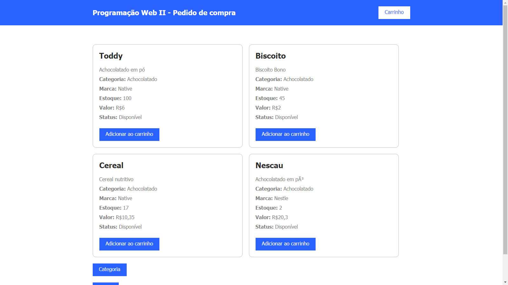

<h1 align="center">
    PJ-Ecommerce
</h1>

  <a href="#-tecnology">Tecnology</a>&nbsp;&nbsp;&nbsp;|&nbsp;&nbsp;&nbsp;
  <a href="#-project">Project</a>&nbsp;&nbsp;&nbsp;|&nbsp;&nbsp;&nbsp;
  <a href="#-license">License</a>

 

  

 

# 💻 Project

projeto realizado na faculdade para estudo de programação web feito em PHP e com Banco de Dados MySql, trata-se de um projeto que simula um ecommerce

# 🎬 Preview

  

## 🚀 Technology

This project was developed with the following technologies:

- [PHP]()
- [MySql]()
